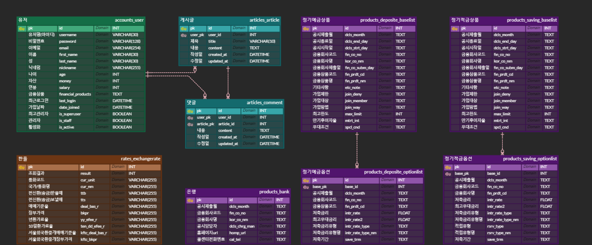

# 석세권 뱅크 (SSAFY FINAL PROJECT)

## 1. 팀원정보 및 업무 분담 내역

1. 팀장 : 양원석

   역할 :

   - 로그인, 로그아웃
   - 회원가입 기능
   - 예적금 데이터 상품, 상세 조회
   - 프로필 기능
   - 금융 상품 추천 알고리즘

2. 팀원 : 송민석

   역할 :

   - 커뮤니티 게시글 기능
   - 커뮤니티 댓글 기능
   - 환율 계산 기능
   - 주변 은행 검색 기능

---

## 2. 설계 내용(아키텍쳐 등) 실제 구현 정도

### 1. 메인 페이지

- 매우 짧은 영상을 메인페이지에서 제공함

### 2. 회원 커스터 마이징

- 회원 관리를 할 수 있는 기능
  1.  회원가입
  2.  로그인
  3.  로그아웃
  4.  비밀번호 찾기 (랜덤한 비밀번호를 생성하고 이를 update하고, 유저의 email로 전송)
  5.  비밀번호 변경
- Django의 기본 User 를 상속받아 커스텀 User를 구현함
- 유저이름, 이메일, 가입한 상품 목록을 저장할 수 있음

### 3. 예적금 금리비교

1. 데이터 저장
   - 이미 DB에 존재하는 데이터는 새로 저장하지 않도록 하고
     새로운 데이터는 DB에 새로 저장함
2. 전체 조회
   - 모든 상품 목록을 table 형태로 제공함
   - 은행과 해당상품의 저축기간을 기반으로 필터링 기능을 제공함
   - 특정 상품을 클릭시 상세 정보를 제공함
3. 상세 조회
   - 해당 금융 상품에 대한 자세한 정보를 출력함
   - 로그인이 된 경우 유저가 가입하지 않은 상품이라면 '가입하기' 버튼이, 가입한 상품이라면 '가입한 상태입니다'라는 박스를 보여주고, 가입하기 버튼을 누르면 해당 상품의 코드를 accounts_user의 financial_products 필드에 추가함.

### 4. 환율 계산기

- 백엔드에서 환율 정보를 저장(갱신)하고 이를 전달함.
  - 실제 휴일이거나 오전 11시 이전의 경우 사용 시점으로 부터 가장 가까운 시일의 정보를 가져옴.
- 국가를 선택할 수 있음.
  - 국가 선택시 단위 타국 통화와 그 가치와 동일한 원화를 출력함.
- 국가를 선택한 이후 원화 또는 타국 통화를 입력할 수 있음.
  - 원화 입력시 동일한 가치의 타국 통화를 출력함.
  - 타국 통화 입력시 동일한 가치의 원화를 출력함.

### 5. 근처 은행 검색

- Kakao.Maps API 를 이용하여 지도를 표시함.
- 도/시, 시/군/구, 은행명 을 차례로 선택할 수 있으며 모두 선택 후 검색할 수 있음.
- 검색 시, 해당 지역 근처의 은행을 출력함.

### 6. 커뮤니티(게시판)

- 게시글과 댓글의 조회, 생성, 삭제, 수정 기능이 있음
- 본인이 작성한 게시글과 댓글만 수정과 삭제가 가능함

### 7. 프로필 페이지

- 회원의 기본 정보를 출력하고, 수정 할 수 있는 기능을 제공함
- 비밀번호 변경 기능을 제공함
- 가입한 상품 목록과, 가입한 상품 목록의 저축금리와, 최고우대 금리를 그래프로 출력함.
- 가입한 상품 목록에서 상품을 클릭할 경우, 상세페이지로 이동함
- 상품 추천 알고리즘은 아래 참조

---

## 3. 데이터베이스 모델링(ERD)

## 

## 4. 금융 상품 추천 알고리즘에 대한 기술적 설명

실제 각 사람마다 자주 이용하는 은행이 존재하며 한 은행에서 여러 상품을 이용하는 경우가 많습니다. 이를 고려하여 실제 유저가 가입한 상품을 제공하는 은행의 다른 상품을 추천할 필요가 있다고 생각했습니다. 또한 유저가 가입한 상품과 연관이 없는 상품도 추천하여 여러 상품을 골고루 추천할 필요가 있으므로 이를 고려하여 금융 상품 추천 알고리즘을 설계하였습니다.

- 정리
  1.  실제 유저가 가입한 상품을 제공하는 은행의 다른 상품을 추천할 필요가 있음
  2.  유저와 전혀 상관이 없는 상품도 추천할 필요가 있음

### 따라서 아래의 알고리즘을 작성하였습니다.

- 정기예금과 정기적금에 대하여 같은 알고리즘을 적용하였습니다.
- 해당 알고리즘은 유저가 가입한 상품과 같은 은행의 상품과, 그렇지 않은 상품을 랜덤하게 뽑아 추천할 정기 예적금 상품을 추천합니다.

```js
// 정기예금 추천 알고리즘을 적용한 함수
const getRecommendDeposites = function () {
  // recommendDeposites.value : 추천할 정기예금 배열
  // 모든 정기예금 중 유저가 가입한 상품을 제외시킴
  recommendDeposites.value = deposites.value.filter((elem) => {
    return !deposites.value.includes(userDeposites.value);
  });
  // 유저가 가입한 상품의 은행을 담을 배열
  const tmp = [];
  // 유저가 가입한 상품의 은행이 제공하는 정기예금 배열
  const tmp1 = [];
  // 랜덤한 정기예금 배열
  const tmp2 = [];
  // 유저가 가입한 정기예금의 은행코드를 tmp1에 담음
  for (const co of userDeposites.value.map((elem) => elem.fin_co_no)) {
    tmp.push(co);
  }
  // 모든 정기예금 중 유저가 가입한 상품이 제외된 배열의 원소중
  for (const re of recommendDeposites.value) {
    if (tmp.includes(re.fin_co_no)) {
      // 유저가 가입한 상품의 은행명과 일치하는 원소라면
      tmp1.push(re); // tmp1에 담음
    } else {
      // 아니라면
      tmp2.push(re); // tmp2에 담음
    }
  }
  // 유저와 관계가 없는 정기예금 배열을 섞음
  shuffle(tmp2);
  // 이후 유저가 가입한 정기예금의 은행이 제공하는 정기예금과, 유저와 관계없는 정기예금 배열을 합침
  recommendDeposites.value = [...tmp1, ...tmp2];
  // 이후 앞에서 20개만 자름
  recommendDeposites.value = recommendDeposites.value.slice(0, 20);
  // 이후 20개를 섞음
  shuffle(recommendDeposites.value);
  // 섞인 배열중 앞에서 3개만 자름
  recommendDeposites.value = recommendDeposites.value.slice(0, 3);
};
```

---

## 5. 서비스 대표 기능들에 대한 설명

### 환율 조회 및 계산 기능

- 약 20개 국가의 외화 통화에 대한 환율 정보 제공

### 은행 검색 기능 Map 제공

- 도/시, 시/군/구, 은행명을 select 후 해당 지역에 찾고 있는 은행을 모두 map에 marker 하여 정보 제공

### 금융 정기 예적금 상품 정보 제공

- 다양한 은행에서 판매하고 잇는 정기 예적금 목록을 제공하며, 특정 은행과 예치기간을 설정하여 해당하는 상품만 조회할 수 있는 기능 제공
- 조회하고자 하는 상품에 대한 상세 옵션 (이자 지급 방식, 저축 금리, 최고 우대 금리, 저축 기간) 설명 및 제공
- 해당 상품을 가입하고 싶다면, 가입하기 옵션을 제공하여 마이페이지에 가입한 상품 목록에 해당 상품 정보를 조회할 수 있는 기능 제공

### 커뮤니티 (게시글 , 댓글 작성 기능)

- 로그인 한 사용자에게만 커뮤니티 기능 조회를 제공하며 , 게시글 작성, 댓글 작성, 게시글 목록과 댓글 목록을 조회할 수 있으며
- 본인이 작성한 게시글과 댓글에만 수정과 삭제 버튼 보기를 제공하여 이를 진행할 수 있는 기능 제공

### 마이페이지(프로필 기능)

- 로그인한 회원은 마이페이지 프로필 기능 조회를 할 수 있으며 , 기본정보수정(이메일,닉네임,나이 현재 가진금액, 연봉) 을 수정 할 수있고 비밀번호를 변경할 수 있음.
- 또한 본인이 가입한 상품을 따로 조회할 수 있으며 해당 상품 클릭 시 , 해당 상품에 대한 상세 정보 내용 조회를 가능하게 하도록 함.
- 또한 상품 추천 받기 기능을 제공하여 알고리즘을 통해 자신에게 맞는 예적금 상품을 최소 3가지씩 추천받을 수 있도록 함.

---

## 6. 기타(느낀 점, 후기 등)

양원석 : 

한 학기 동안 수업을 통해 많은 내용을 학습하였지만 프로젝트중 여러 문제를 경험하면서 부족함을 느꼈습니다. 이러한 문제들을 공식문서와 chat GPT를 적극 활용하여 문제점을 찾고 이를 해결하였습니다. 개인적으로 실제 코드를 작성하는 것도 매우 중요하지만, 이론으로 학습한 내용을 통해서 여러 자료를 보고 이를 활용하는 능력도 매우 중요하다 라는 것을 알게되었습니다. 또한,
프로젝트가 종료된 이후 한 학기 동안 학습한 내용을 정리할 필요성을 느꼈습니다.

---
송민석 : 

ssafy에서의 첫 프로젝트를 아주 유능한 페어와 함께하게 되어 영광이었습니다. 덕분에 많이 배웠습니다. django와 vue를 배웠지만 막상 앱을 만들려고 이를 적용해보니 쉽지 않았습니다.  그런 상황이 올때마다 유능한 페어에게 배우고 GPT 프로그램을 사용하여 위기를 헤쳐나갔습니다.

이번 프로젝트에서 가장 큰 수확은 코드 하나하나의 의미를 정확히 이해하고 작성해나가야한다는 교훈을 얻게 되었습니다. 